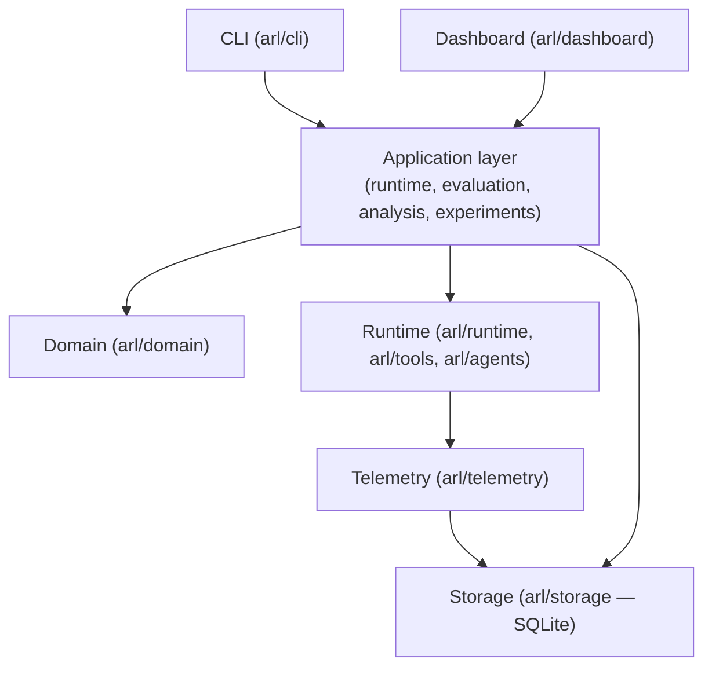
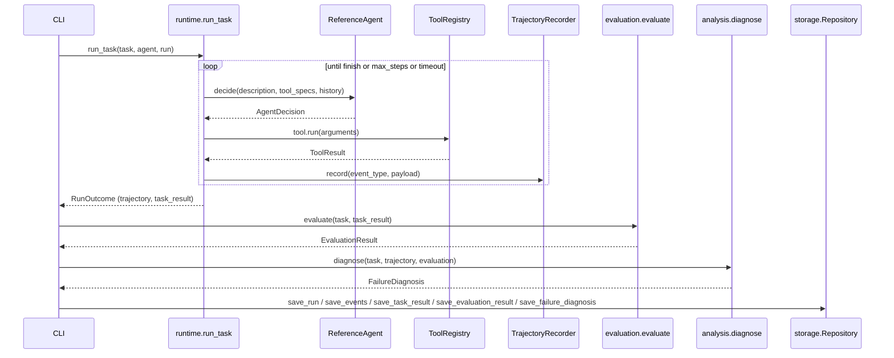

# Architecture

## Layers

## Why these boundaries exist

**Domain (`arl/domain`) has no dependencies on anything else in the
package.** `Task`, `Run`, `Trajectory`, `TrajectoryEvent`,
`EvaluationResult`, `FailureDiagnosis`, `Experiment`, `Metric` are Pydantic
models with no I/O and no business logic beyond validation. Every other
layer imports from here; nothing here imports from anywhere else. This is
what makes it possible to write unit tests for detectors, features, and
graders without a database or a running agent.

**Runtime (`arl/runtime`, `arl/tools`, `arl/agents`) owns execution.** The
`Agent` protocol (`arl/agents/base.py`) is the seam between "how a
decision gets made" and "what happens once it's made" — `run_task`
(`arl/runtime/runner.py`) doesn't know or care whether the agent is the
scripted reference implementation or a future adapter wrapping a real
model. Tools (`arl/tools/`) are similarly decoupled from any particular
agent: they're plain callables with a schema, registered per-run in a
`ToolRegistry`.

**Telemetry (`arl/telemetry`) sits between runtime and storage** and does
exactly one job: turn agent/tool activity into `TrajectoryEvent` objects,
applying redaction along the way. It's a separate layer (not folded into
the runner) because "what gets recorded and how it gets sanitized" is a
concern independent of "what actually ran" — see `SECURITY.md` for why
redaction happens here rather than at the storage boundary.

**Storage (`arl/storage`) is intentionally thin.** One `Repository` class,
direct SQL, no ORM. The schema (`arl/storage/schema.py`) uses
`CREATE TABLE IF NOT EXISTS` rather than a migrations framework — that's a
real limitation (see the note at the top of `schema.py`), accepted because
a single-file local SQLite database for a local-first tool doesn't yet
need one.

**Evaluation (`arl/evaluation`) and analysis (`arl/analysis`) are pure
functions over domain objects.** `evaluate(task, task_result) ->
EvaluationResult` and `diagnose(task, trajectory, evaluation) ->
FailureDiagnosis` take domain objects in and return domain objects out,
with no side effects. This is why they're the easiest parts of the system
to unit test, and why the failure-analysis detectors
(`arl/analysis/detectors.py`) can be tested individually against
hand-built event lists rather than through a full run.

**Reliability (`arl/reliability`) depends on runtime + evaluation but
nothing depends on it** except the CLI and the (optional, currently
post-hoc) intervention mechanism in `arl/experiments`. This keeps the ML
component genuinely optional — `arl benchmark run` and `arl runs inspect`
work with zero scikit-learn model ever having been trained.

**CLI (`arl/cli`) and dashboard (`arl/dashboard`) are two independent
presentation layers over the same `Repository`.** Neither depends on the
other. The dashboard is a FastAPI app with JSON endpoints and one
server-rendered HTML page with vanilla JS — no separate frontend build
step, because the data volumes this tool operates at (hundreds of local
runs) don't justify one.

## Data flow for one benchmark run

